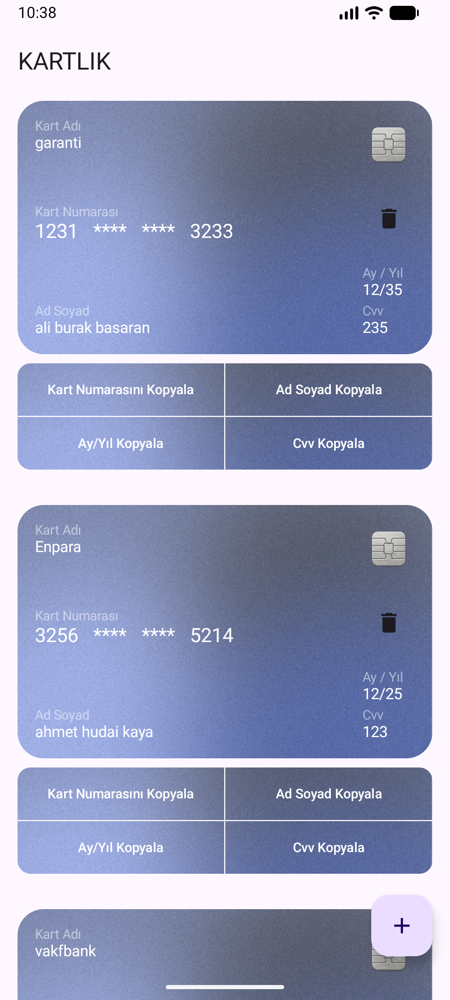
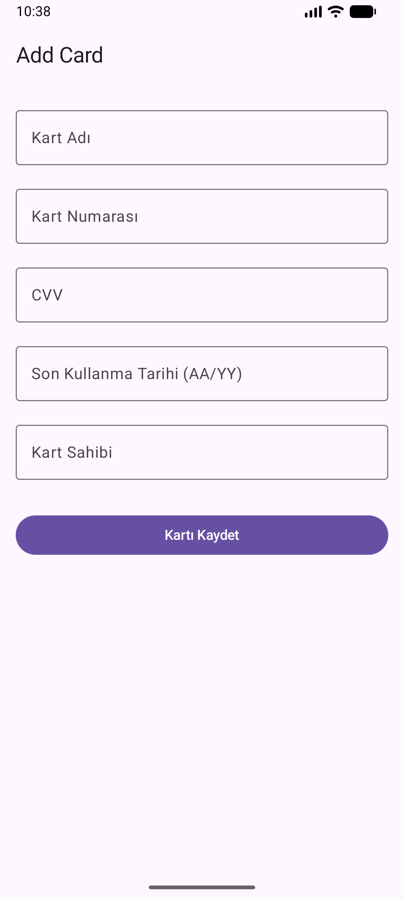

# 💳 Bank Wallet - Kart Yönetim Uygulaması

Bank Wallet, kullanıcıların kredi ve banka kartlarını güvenli bir şekilde saklayıp yönetebileceği, Jetpack Compose ile geliştirilmiş modern bir Android uygulamasıdır.

## 📋 İçerik

- [Geliştirme Notları](#geliştirme-notları)
- [Özellikler](#özellikler)
- [Teknoloji Stack](#teknoloji-stack)
- [Proje Yapısı](#proje-yapısı)
- [Kurulum](#kurulum)
- [Kullanım](#kullanım)
- [Ekran Görüntüleri](#ekran-görüntüleri)
- [API Mimarisi](#api-mimarisi)
- [Veritabanı](#veritabanı)
- [İç Yapı](#iç-yapı)

---

## 📊 Geliştirme Notları

### Mimari Kararlar
1. **Clean Architecture**: Katmanlar arasında bağımlılık yönetimi
2. **MVVM + MVI**: Modern state management
3. **Room Database**: Type-safe veritabanı erişimi
4. **Hilt**: Compile-time dependency injection
5. **Jetpack Compose**: Modern UI framework

### Best Practices
- ✅ Coroutines ile async işlemler
- ✅ StateFlow ile reactive UI updates
- ✅ Repository pattern ile data abstraction
- ✅ Separation of Concerns (SOC)
- ✅ SOLID Principles

### Performance
- Lazy loading kartlar
- Efficient state updates
- Database indexing
- Memory optimized images

---


## ✨ Özellikler

### Temel Fonksiyonlar
- ✅ **Kart Ekleme**: Yeni kredi/banka kartı ekleyin
- ✅ **Kart Silme**: İstenmeyen kartları silin
- ✅ **Kart Listeleme**: Eklenen tüm kartları görüntüleyin
- ✅ **Hızlı Kopyala**: Kart bilgilerini tek tıkla clipboard'a kopyalayın
    - Kart numarasını kopyala
    - Ad/Soyad bilgisini kopyala
    - Son kullanma tarihi (Ay/Yıl) kopyala
    - CVV kopyala

### Tasarım Özelliği
- 🎨 Kartlar gerçekçi bir kart tasarımıyla gösterilir
- 🔐 Kart numarası güvenli şekilde maskeli gösterilir (ilk 4 ve son 4 hane görünür)
- 📱 Responsive tasarım - Tüm ekran boyutlarında uyumlu
- 🌙 Modern Material Design 3 kullanıcı arayüzü

### Güvenlik
- 🛡️ Kart numarası maskeleme (****) ile gösterilir
- 📋 Clipboard'a kopyalama sırasında toast notifikasyon
- 💾 Veritabanında güvenli saklama

---

## 🏗️ Teknoloji Stack

| Teknoloji | Versiyon | Amaç |
|-----------|---------|------|
| **Kotlin** | 2.0+ | Programlama Dili |
| **Jetpack Compose** | 1.7+ | UI Framework |
| **Material Design 3** | 1.2+ | Tasarım Sistemi |
| **Room Database** | 2.6+ | Lokal Veritabanı |
| **Hilt** | 2.48+ | Dependency Injection |
| **Coroutines** | 1.7+ | Asynchronous Programming |
| **Flow** | - | State Management |
| **Java** | 21 | Compatibility Level |
| **Gradle** | 8.5+ | Build Tool |

---

## 📁 Proje Yapısı

```
BankWallet/
├── app/
│   ├── src/
│   │   ├── main/
│   │   │   ├── java/com/example/bankwallet/
│   │   │   │   ├── BankWalletApp.kt                 # Hilt Application
│   │   │   │   ├── MainActivity.kt                  # Main Activity
│   │   │   │   ├── data/                            # Data Layer
│   │   │   │   │   ├── database/
│   │   │   │   │   │   ├── CardDatabase.kt          # Room Database
│   │   │   │   │   │   └── CardDao.kt               # Database Access Object
│   │   │   │   │   ├── entity/
│   │   │   │   │   │   └── CardEntity.kt            # Veritabanı Entity
│   │   │   │   │   └── repository/
│   │   │   │   │       └── CardRepositoryImpl.kt     # Repository Implementasyonu
│   │   │   │   ├── domain/                          # Domain Layer
│   │   │   │   │   ├── model/
│   │   │   │   │   │   └── Card.kt                  # Domain Model
│   │   │   │   │   └── repository/
│   │   │   │   │       └── CardRepository.kt        # Repository Interface
│   │   │   │   ├── presentation/                    # Presentation Layer
│   │   │   │   │   ├── card/
│   │   │   │   │   │   ├── CardListScreen.kt        # Kart Listesi Ekranı
│   │   │   │   │   │   ├── CardAddScreen.kt         # Kart Ekleme Ekranı
│   │   │   │   │   │   ├── CardViewModel.kt         # ViewModel
│   │   │   │   │   │   ├── CardIntent.kt            # User Intents
│   │   │   │   │   │   └── CardState.kt             # UI State
│   │   │   │   ├── di/                              # Dependency Injection
│   │   │   │   │   └── AppModule.kt                 # Hilt Modules
│   │   │   │   └── ui/                              # UI Resources
│   │   │   │       ├── theme/
│   │   │   │       │   ├── Color.kt                 # Renkler
│   │   │   │       │   ├── Type.kt                  # Tipografi
│   │   │   │       │   └── Theme.kt                 # Tema
│   │   │   │       └── drawable/
│   │   │   │           ├── card_background.png      # Kart Arka Planı
│   │   │   │           └── chip.png                 # Kart Çipi
│   │   │   └── AndroidManifest.xml
│   │   ├── androidTest/                             # Android Test
│   │   └── test/                                    # Unit Test
│   ├── build.gradle.kts                             # App Module Build Config
│   └── proguard-rules.pro                           # ProGuard Rules
├── gradle/                                          # Gradle Wrapper
├── build.gradle.kts                                 # Root Build Config
├── settings.gradle.kts                              # Gradle Settings
├── gradle.properties                                # Gradle Properties
└── README.md                                        # Bu dosya
```

---

## 🔧 Kurulum

### Sistem Gereksinimleri
- Android Studio 2024.1+
- Java 21+
- Gradle 8.5+
- Min SDK: 31 (Android 12)
- Target SDK: 36 (Android 15)

### Adımlar

1. **Depoyu Klonlayın**
   ```bash
   git clone https://github.com/yourusername/BankWallet.git
   cd BankWallet
   ```

2. **Gradle Senkronizasyonu**
    - Android Studio'da açın
    - `File` → `Sync Now` tıklayın veya otomatik senkronizasyon bekleyin

3. **Projeyi Derleyin**
   ```bash
   ./gradlew build
   ```

4. **Uygulamayı Çalıştırın**
    - Emülatör veya fiziksel cihaz bağlayın
    - `Run` → `Run 'app'` tıklayın veya `Shift + F10` basın

---

## 📱 Kullanım

### Ana Ekran (Kart Listesi)
1. Uygulamayı açtığınızda tüm kayıtlı kartlar listelenir
2. Her kart gerçekçi bir tasarımla gösterilir
3. Kart üzerinde şu bilgiler görünür:
    - 💳 Kart adı
    - 🔢 Kart numarası (maskelenmiş)
    - 👤 Kart sahibi adı
    - 📅 Son kullanma tarihi
    - 🔐 CVV kodu

### Kart Ekleme
1. Sağ alt köşedeki **"+"** butonuna tıklayın
2. Kart bilgilerini doldurun:
    - Kart Adı (örn: "Kredi Kartı", "Banka Kartı")
    - Kart Numarası (16 haneli)
    - Kart Sahibi Adı
    - Son Kullanma Tarihi (MM/YY)
    - CVV Kodu
3. "Kaydet" butonuna tıklayın

### Hızlı Kopyala Özelliği
Her kart altında 4 buton bulunur:
- **Kart Numarasını Kopyala**: Tam kart numarasını kopyalar
- **Ad Soyad Kopyala**: Kart sahibi adını kopyalar
- **Ay/Yıl Kopyala**: Son kullanma tarihini kopyalar
- **CVV Kopyala**: CVV kodunu kopyalar

Buton tıklandığında "Kopyalandı!" mesajı gösterilir.

### Kart Silme
1. Silmek istediğiniz kartı açın
2. Kart üzerindeki **çöp kutusu** ikonuna tıklayın
3. Kart silinecektir

---

## 📸 Ekran Görüntüleri

### Ana Ekran



### Kart Ekleme Ekranı



---

## 🏗️ API Mimarisi

Proje **Clean Architecture** prensipleriyle tasarlanmıştır ve üç ana katmandan oluşur:

### 1. Data Layer (Veri Katmanı)

**CardDatabase.kt**
```kotlin
@Database(entities = [CardEntity::class], version = 1)
abstract class CardDatabase : RoomDatabase() {
    abstract fun cardDao(): CardDao
}
```

**CardDao.kt**
```kotlin
@Dao
interface CardDao {
    @Insert
    suspend fun insertCard(card: CardEntity)
    
    @Delete
    suspend fun deleteCard(card: CardEntity)
    
    @Query("SELECT * FROM cards")
    fun getAllCards(): Flow<List<CardEntity>>
}
```

**CardRepositoryImpl.kt**
```kotlin
class CardRepositoryImpl(private val cardDao: CardDao) : CardRepository {
    override fun getAllCards(): Flow<List<Card>> = 
        cardDao.getAllCards().map { entities ->
            entities.map { it.toDomainModel() }
        }
    
    override suspend fun addCard(card: Card) {
        cardDao.insertCard(card.toEntity())
    }
    
    override suspend fun deleteCard(card: Card) {
        cardDao.deleteCard(card.toEntity())
    }
}
```

### 2. Domain Layer (Domain Katmanı)

**CardRepository.kt** (Interface)
```kotlin
interface CardRepository {
    fun getAllCards(): Flow<List<Card>>
    suspend fun addCard(card: Card)
    suspend fun deleteCard(card: Card)
}
```

**Card.kt** (Model)
```kotlin
data class Card(
    val id: Int = 0,
    val cardName: String,
    val cardNumber: String,
    val ownerName: String,
    val expirationDate: String,
    val cvv: String
)
```

### 3. Presentation Layer (Sunum Katmanı)

**CardViewModel.kt**
```kotlin
@HiltViewModel
class CardViewModel @Inject constructor(
    private val repository: CardRepository
) : ViewModel() {
    private val _state = MutableStateFlow(CardState())
    val state: StateFlow<CardState> = _state.asStateFlow()
    
    init {
        loadCards()
    }
    
    private fun loadCards() {
        viewModelScope.launch {
            repository.getAllCards().collect { cards ->
                _state.value = _state.value.copy(cards = cards)
            }
        }
    }
    
    fun handleIntent(intent: CardIntent) {
        when (intent) {
            is CardIntent.DeleteCard -> deleteCard(intent.card)
            is CardIntent.AddCard -> addCard(intent.card)
        }
    }
    
    private fun deleteCard(card: Card) {
        viewModelScope.launch {
            repository.deleteCard(card)
        }
    }
    
    private fun addCard(card: Card) {
        viewModelScope.launch {
            repository.addCard(card)
        }
    }
}
```

**CardState.kt**
```kotlin
data class CardState(
    val cards: List<Card> = emptyList(),
    val isLoading: Boolean = false,
    val error: String? = null
)
```

**CardIntent.kt**
```kotlin
sealed class CardIntent {
    data class DeleteCard(val card: Card) : CardIntent()
    data class AddCard(val card: Card) : CardIntent()
}
```

---

## 💾 Veritabanı

### Entity Yapısı

**CardEntity.kt**
```kotlin
@Entity(tableName = "cards")
data class CardEntity(
    @PrimaryKey(autoGenerate = true)
    val id: Int = 0,
    val cardName: String,
    val cardNumber: String,
    val ownerName: String,
    val expirationDate: String,
    val cvv: String
)
```

### Veritabanı Özellikleri
- **Database Type**: SQLite (Room)
- **Table Name**: `cards`
- **Version**: 1
- **Primary Key**: `id` (Auto Generated)
- **Columns**:
    - `id`: INT (Primary Key)
    - `cardName`: TEXT
    - `cardNumber`: TEXT
    - `ownerName`: TEXT
    - `expirationDate`: TEXT
    - `cvv`: TEXT

---

## 🔄 İç Yapı

### State Management
- **StateFlow**: Ana state yönetimi için
- **Coroutines**: Asynchronous işlemler için
- **Flow**: Veritabanı değişikliklerini takip etmek için

### Dependency Injection
```kotlin
@Module
@InstallIn(SingletonComponent::class)
object AppModule {
    
    @Provides
    @Singleton
    fun provideCardDatabase(app: Application): CardDatabase =
        Room.databaseBuilder(app, CardDatabase::class.java, "card_database")
            .build()
    
    @Provides
    @Singleton
    fun provideCardDao(database: CardDatabase): CardDao =
        database.cardDao()
    
    @Provides
    @Singleton
    fun provideCardRepository(cardDao: CardDao): CardRepository =
        CardRepositoryImpl(cardDao)
}
```

### Jetpack Compose UI
- **Composable Functions**: UI bileşenleri
- **Material 3**: Modern tasarım sistemi
- **State Hoisting**: State yönetimi
- **Preview**: UI önizlemesi

---

## 🎨 UI Tasarım

### Renkler (Color.kt)
```kotlin
val Purple80 = Color(0xFFD0BCFF)
val Purple40 = Color(0xFF6650a4)
val PinkAccent = Color(0xFFFF1493)
val DarkBackground = Color(0xFF1A1A1A)
val White = Color(0xFFFFFFFF)
val LightGray = Color(0xFFB0B0B0)
```

### Tipografi (Type.kt)
- **displayLarge**: Başlıklar
- **headlineMedium**: Alt başlıklar
- **bodyMedium**: Ana metin
- **labelSmall**: Etiketler

### Material 3 Tema
- Dinamik renk sistemi
- Responsive tasarım
- Erişilebilirlik desteği

---

## 🧪 Test

### Unit Tests
```bash
./gradlew test
```

### Android Tests
```bash
./gradlew connectedAndroidTest
```

---

## 🐛 Bilinen Sorunlar

- [ ] Eksik validasyon hataları kart ekleme ekranında
- [ ] Crash handling geliştirilmesi gerekiyor
- [ ] Offline senkronizasyon desteklenmez

---

## 🚀 Gelecek Özellikler

- [ ] 🔐 Biometric Authentication
- [ ] 🌐 Cloud Backup & Sync
- [ ] 📊 Kart İstatistikleri
- [ ] 🔔 Kart Hatırlatıcıları
- [ ] 🎨 Tema Özelleştirmesi
- [ ] 🌍 Multi-language Support
- [ ] 📤 Kart Paylaşımı
- [ ] 🔍 Kart Arama

---

## 📝 Lisans

Bu proje MIT Lisansı altında açıktır.

---

## 👤 Geliştirici

**BankWallet Development Team**

- 📧 Email: bdogusizgi@gmail.com
- 🐙 GitHub: https://github.com/dodoizgi
- 🔗 LinkedIn: https://www.linkedin.com/in/do%C4%9Fu%C5%9F-izgi-396554185/$0

---

## 🤝 Katkıda Bulunma

Katkılarınız hoş geldiniz! Lütfen şu adımları izleyin:

1. Fork edin
2. Feature branch oluşturun (`git checkout -b feature/AmazingFeature`)
3. Değişiklikleri commit edin (`git commit -m 'Add some AmazingFeature'`)
4. Branch'e push edin (`git push origin feature/AmazingFeature`)
5. Pull Request açın

---

## 📞 Destek

Sorunla karşılaştıysanız:
1. [Issues](https://github.com/yourusername/BankWallet/issues) sayfasını kontrol edin
2. Yeni bir issue açın
3. Şablonu izleyin ve ayrıntılı bilgi verin

---

## ⭐ Beğendiyseniz

Projeyi beğendiyseniz bir yıldız (⭐) verebilirsiniz!

---

**Son Güncelleme**: Kasım 2025 | **Versiyon**: 1.0
